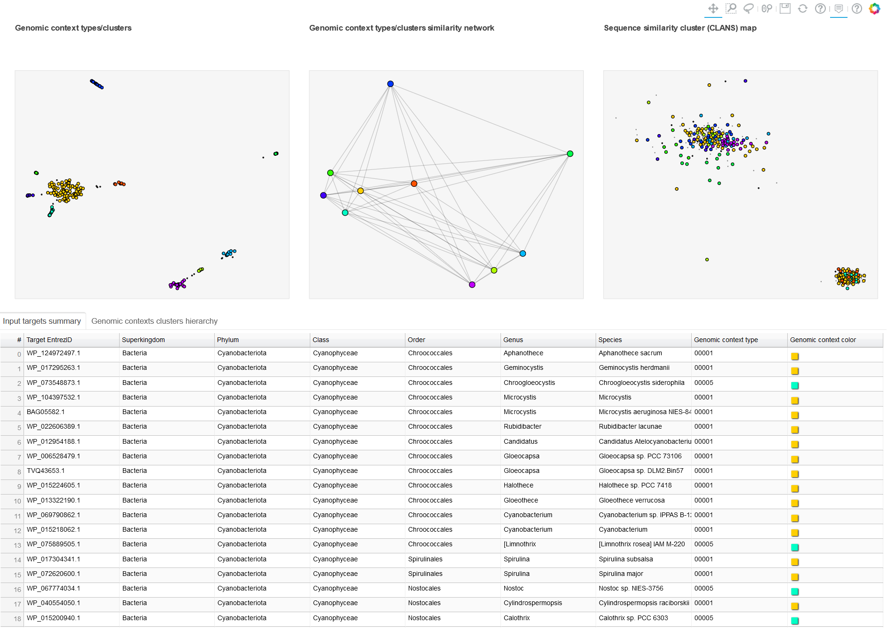
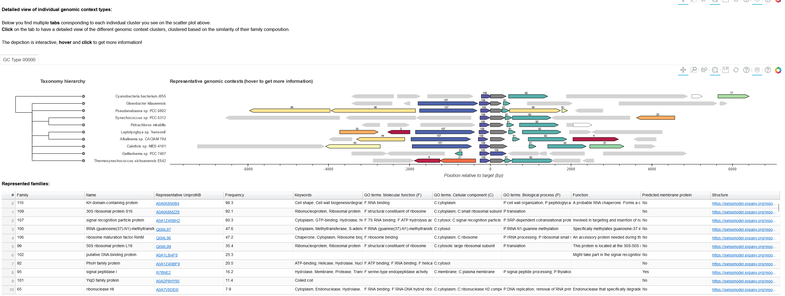

# GCsnap2.0 Desktop

This is the implementation of GCsnap2.0 as a desktop application.

GCsnap is a flexible Python-based tool that allows for the interactive comparison of the genomic contexts of protein-coding genes from any genome at any taxonomic level, integrating them with functional and structural information for any of the genes shown. 


By connecting the output to different protein databases, the user can navigate through the different genomic contexts from a simple interactive platform, facilitating the further analysis of the contexts found. 

GCsnap is not limited to a single input format, can preform batch jobs and accepts protein classification maps. 

All information is stored in detailed, human and machine-readable files, and customable publication-ready figures.  


Thank you for using and showing interest on GCsnap!

## Dependencies

GCsnap2.0 Desktop was written in Python 3.11. It was tested on Python 3.11. It requires mostly core Python modules and some external packages: 
  - Biopython
  - Bokeh
  - Matplotlib
  - Networkx 
  - PaCMAP
  - Scikit-learn
  - Pandas
  - Rich
  - Urllib3 and Requests
  - Jinja2

For detailed requirements including working versions, check ```pyproject.toml```.

Additionally, GCsnap relies on a local installation of MMseqs or for Windows users, the static binary. See below for installation details.
## Installation

### Installing from Source

Clone the repository with git, create a Conda environment and install:

**Linux/MacOS**
```
# To download
git clone https://github.com/RetoKrummenacher/GCsnap
cd GCsnap

# Change to new developpment branch 
git checkout gcsnap2desktop

# To install
conda create -n GCsnap -c conda-forge -c bioconda gcc=14.1 python=3.11 mmseqs2
conda activate GCsnap
pip install .
```

**Windows**  
There is no MMseqs2 installation candidate, just create Conda environment without mmseqs2 and get the static binary executable from here: https://mmseqs.com/latest/. Download, extract and store locally.
When running GCsnap, pass the path to the executable (i.e., mmseqs.bat) via the ```--mmseqs-executable-path``` argument.
```
# To download
git clone https://github.com/RetoKrummenacher/GCsnap
cd GCsnap

# Change to new developpment branch 
git checkout gcsnap2desktop

# To install
conda create -n GCsnap -c conda-forge -c bioconda gcc=14.1 python=3.11
conda activate GCsnap
pip install .
```


## Allowed inputs

GCsnap takes as main input a list of sequence identifiers, which can be in **RefSeq, EMBL-CDS, UniProtKB, UniRef, GeneID, and ENSEMBLE ID formats, or a mix**. These identifiers can be given as:
  - a text file, where each is in a different line
  - a fasta file, where the sequence header starts with the sequence identifier
  - a sequences cluster file in CLANS format
  - direct input in the terminal as a space-separated list
  
## Usage

In its most simple mode of usage, GCsnap only requires a list of sequence identifiers. 

**Required** arguments are:
```
  --targets: which can be a list of sequence identifiers, a text file, a fasta file, a clans file or a list of files
```
**Optional** arguments allow for the tweaking of GCsnap behaviour. Default values for arguments are taken from the  ```config.yaml```. They can be changed there directly or pass via the CLI, e.g., ```--n-cpu 2```.  
If the configuration file is not found, it is created with default values and can be edited for future runs.
A list of all possible arguments and their current default value can be show in the terminal via:
```  
  GCsnap --help 
```

The most relevant arguments are:
```  
  --n-cpu: the number of cores of zour CPU to be used when processing.
  --n-flanking5: the number of flanking genes to be taken on the 5' side.
  --n-flanking3: the number of flanking genes to be taken on the 3' side.
  --ncbi-user-email: it may be required to access the NCBI databases. It is not used for anything else.
  --ncbi-api-key: the key for NCBI API, which allows for up to 10 queries per second to NCBI databases. Can be obtained after   obtaing an NCBI account.
  --get-taxonomy: set to false if no taxonomy is to be collected.
  --annotate-TM: set to true to annotate the presence of transmembrane segments and signal peptides.
  --annotation-TM-mode: the mode to use to collect transmembrane and signal peptide annotations (phobius, tmhmm or uniprot).
  --clans-pattern: a set of patterns in CLANS groups names that define different groups to be considered as independent jobs.
  --operon-cluster-advanced: set to true to have a more comprehensive analysis/summary of the genomic contexts found. Ideal for very large input sets.  
```

For Windows users:
```  
  --mmseqs-executable-path: path to MMseqs executable (i.e., mmseqs.bat) if not installed in Conda environment.
```

## 1. Simple job
Using the example in folder ```examples/ybez_KHI```, the input file ```targets_ybez_selected.txt``` contains a list of protein sequence identifiers in UniprotKB format. Running:

```
GCsnap --targets targets_ybez_selected.txt
```
or on Windows
```
GCsnap --targets targets_ybez_selected.txt  --mmseqs-executable-path C:\path_to_mmseqs_exec\mmseqs.bat
```

will generate the output folder ```targets_ybez_selected```, where all output files and figures are stored. This will NOT annotate transmembrane segments and signal peptides.

In order to do so, one shall run:
```
GCsnap --targets targets_ybez_selected.txt --annotate-TM True
```
which will by default collect that information from Uniprot.

## 2. Job from a CLANS file
Using the example in folder examples/yqlc_KHII/, the input file yqlc_nostoc_blast_nrbac70.clans is a classification file encompassing two clusters of sequences, which are named cluster1_cyanobacteria and cluster2_allothers. Running:
```
 GCsnap --targets yqlc_nostoc_blast_nrbac70.clans
```
will make GCsnap consider all identifiers as a single job, while running:
```
 GCsnap --targets yqlc_nostoc_blast_nrbac70.clans  --clans-pattern cluster 
```
will make GCsnap identify all clusters in the CLANS file that have 'cluster' in their name, which will be considered as two independent jobs, generating the two folders [cluster1_cyanobacteria](./examples/yqlc_KHII/clans_cluster/cluster1_cyanobacteria/) and [cluster2_allothers](./examples/yqlc_KHII/clans_cluster/cluster2_allothers/).


## 3. Advanced genomic context analysis
GCsnap incorporates an "Advanced mode", which can be used by setting the -operon_cluster_advanced flag to True. This mode uses PaCMAP (https://github.com/YingfanWang/PaCMAP) to search for clusters of similar genomic contexts and, instead of displaying all contexts in one single view, first generates a summary page displaying the clusters of genomic contexts found and a "family composition spectrum", allowing for better interpretation of the diversity of genomic contexts found. In addition, a detailed page is generated for each genomic context cluster/type defined, which includes the classic genomic context block but also a table listing the properties of the protein families defined. This new mode is useful for the analysis of very large input sets (thousands of sequences or large CLANS cluster maps)

Using the example in folder examples/yqlc_KHII/ [examples/yqlc_KHII/](./examples/yqlc_KHII/) and the input file yqlc_nostoc_blast_nrbac70.clans without defining target clusters (i.e., it will use all sequences in the map), we can run a simple advanced job by running:
```
GCsnap --targets yqlc_nostoc_blast_nrbac70.clans --operon-cluster-advanced True
```
The output summary page displays on the top 3 different scatter plots, where the color of the dots corresponds to the type of the genomic context they belong to. As the input file was a CLANS file, GCsnap recognized it as such and thus diplays it. Otherwise, the area would be white unless an input CLANS file is given explicitly. Each sequence is listed below these 3 scatter plots within a table, with their corresponding associated genomic context type as well as their collected taxonomy. The button next to the top of the table allows for changing the display and shows a sorted spectrum of family compositions for each context type.
  

The figure below shows the summary page for genomic context type 0000. 


## Citing GCsnap

J. Pereira, GCsnap: interactive snapshots for the comparison of protein-coding genomic contexts, 
J. Mol. Biol. (2021) 166943. https://doi.org/https://doi.org/10.1016/j.jmb.2021.166943.

## Acknowledgements

GCsnap was developed during the COVID-19 lockdown.

I would like to thank Prof. Andrei N. Lupas, Dr. Laura Weidmann-Krebs, Dr. Marcus Hartmann, Dr. Vikram Alva, Dr. Felipe Merino, Dr. Jörg Martin, Dr. Adrian Fuchs, Hadeer Elhabashy, Prof. Volkmar Braun, Dr. João Rodrigues and Dr. João Barros for the great support and the insightful discussions that helped the development of GCsnap.

GCsnap is being maintained and further developed at the Biozentrum of the University of Basel, and I would like to thank the Schwede team, the Basler group and the Ciorba group for insightful discussions that are driving many new developments.